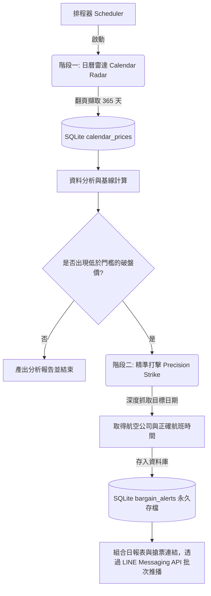

# 機票撿漏系統需求規格書 (System Requirements Specification - Google Flights 版)

## 1. 系統目標 (System Objective)
打造一套全自動的「全球機票撿漏監控系統」。
系統必須能**高效且穩定地監控從台北 (TPE) 出發至全球設定檔中所有重點城市，未來一整年 (365 天) 內的票價波動**。透過建立長期的價格歷史大數據 (Baseline)，精準抓出突發性的「標錯價 (Error Fare)」或「極端促銷 (Bargain)」，並透過 LINE 即時通報。

## 2. 核心技術架構
*   **核心引擎：Google Flights**
    *   系統全面針對 **Google Flights** 進行資料抓取。
    *   Google Flights 擁有最即時、最齊全的傳統航空與低成本航空 (LCC) 票價大數據。
*   **爬蟲技術：Playwright (自動化瀏覽器)**
    *   使用 Playwright 操控瀏覽器，透過模擬真實使用者行為，直接在 Google Flights 介面上進行搜尋與資料擷取。
    *   **兩段式架構**：採用「日曆大範圍掃描」與「針對性深度抓取」雙軌並行，極大化效能。
    *   **瀏覽器必須以無頭模式 (Headless Mode) 執行**，所有爬取操作皆在背景靜默完成。

## 3. 核心功能需求 (Core Features)

### 3.1 監控範圍與目標 (Monitoring Scope)
系統目前設定監控以下全球重點城市：
*   **短程亞洲線 (預設 7 天來回)**：
    *   東京羽田 (HND)、首爾仁川 (ICN)、新加坡樟宜 (SIN)、吉隆坡 (KUL)、新疆烏魯木齊 (URC)、雲南昆明 (KMG)、越南胡志明市 (SGN)
*   **長程歐美線 (預設 14 天來回)**：
    *   英國倫敦 (LHR)、法國巴黎 (CDG)、美國奧蘭多 (MCO)、埃及開羅 (CAI)、挪威奧斯陸 (OSL)、義大利羅馬 (FCO)、希臘雅典 (ATH)

### 3.2 階段一：日曆大雷達掃描 (Calendar Radar)
*   **一整年全掃描**：系統針對單一航線開啟出發日期的「日曆介面 (Calendar Grid)」，透過 JavaScript 自動滾動到底部，一次性擷取日曆上未來 330 天（Google Flights 上限）的每日最低票價。
*   **雙模式支援**：同時掃描「單程 (One-Way)」與「來回 (Round-Trip)」的日曆票價矩陣。
*   **極速收集**：大幅減少 HTTP 請求與瀏覽器開銷，將全航線、全年度的價格掃描壓縮在數分鐘內完成。

### 3.3 階段二：精準打擊與撿漏判定 (Precision Strike & Bargain Detection)
*   **觸發條件過濾**：系統自動分析第一階段所收集到的 330 天日曆價格，當發現某日的票價低於設定的「撿漏門檻」（例如低於歷史中位數的 70%）時，即標記為「破盤嫌疑日」。
*   **深度抓取**：針對「破盤嫌疑日」，系統派出第二階段深度爬蟲，針對該特定日期進入搜尋結果頁面，精準抓取「航空公司」、「航班號碼」與「起飛時間」。
*   **防誤判機制**：深度抓取也能進一步確認日曆上的低價是否為幽靈票，確保警報的準確度。

### 3.4 永久紀錄與警報推播 (Database & Alerting)
*   **LINE Messaging API 推播**：因 LINE Notify 停用，系統全面改用 LINE Messaging API (Push Message) 發送警報。推播清單會詳細列出各航班的**出發日期、實際飛行的起降時間 (Departure/Arrival Time)、破盤票價以及航空公司航班號碼**。
    *   推播格式範例：
        ```text
        [單程]TPE → LHR (英國倫敦)，價格區間：15,300 - 20,900，中位數：15,900，以下為全年度最便宜的日期：
        ━━━━━━━━━
        📅2026-10-02 (五) 01:00 - 21:00 | 15,316 | 阿提哈德航空 (EY-899)
        ```
*   **合併推播機制 (Batching)**：為節省 API 免費額度，系統會將「掃描日報 (成功率統計)」、「大跌價警報」、「全年最便宜機票」三塊資訊合併為單一或數個長訊息批次發送，超過字元限制時會自動分塊。
*   **成功率日報統計**：每次掃描執行完畢，系統會在推播開頭自動統計並報告當日的「行程抓取成功率」與「價格抓取成功率」。(為求報表美觀，成功率最高自動封頂於 100.0%)

### 3.5 並發效能與反爬蟲突破機制 (Concurrency & Anti-Bot Evasion)
*   **極限並發爬取**：系統支援透過非同步 (`asyncio.Semaphore`) 同時發出大量無頭瀏覽器連線。搭配最新開發的「固定分頁池 (Worker Pool)」，可承受高達 20 個並發分頁同時高速擷取而不會造成資源耗竭。
*   **多維度特徵隨機化與 UI 強制鎖定**：系統針對每個連線隨機分配不同的真實瀏覽器 User-Agent。同時**強制綁定 1920x1080 桌面版解析度與 Desktop User-Agent**，防止無頭模式 (Headless) 觸發 Google 的手機版 RWD 介面，確保日曆元件與「下一頁」按鈕能正確渲染。
*   **精準資源攔截 (Resource Blocking)**：啟動時強制攔截所有圖片 (image) 與媒體檔案 (media) 請求，大幅降低頻寬消耗。為了避免打破前端 React 架構的運作，放行 Fetch/XHR 與字體請求，確保非同步載入功能正常。
*   **隱形斗篷 (Playwright Stealth)**：配置專屬 `--disable-blink-features=AutomationControlled` 參數與 `stealth_async`，完美抹除 WebDriver 特徵，突破基礎的機器人檢測。

### 3.6 測試與品質驗證機制 (Validation & Testing Mechanism)
*   **真實成功率計算**：抓取成功率的計算，其「分母」必須嚴格採用「理論總行程數（設定檔中的城市總數 × 未來 330 天 × 單程/來回 2 種模式）」。絕對不能僅使用爬蟲「有回傳資料的總筆數」作為分母，以真實反映漏抓或失敗的比例。
*   **異常結果 (-1) 全面驗證與補漏**：當第一階段極速爬蟲 (如 `curl_cffi`) 回傳 `-1` (無法解析出有效航班) 時，系統不應直接認定為當日無航班。系統 (主程式 `scraper.py`) 必須自動啟動第二段真實瀏覽器 (Playwright) 針對所有回傳 `-1` 的日期進行網頁端「全面驗證與補漏」，判斷是「真的無班機」還是「Google 採用動態載入隱藏資料」，並極大化撈回原本遺漏的航班資料。

## 4. 資料庫綱要 (Database Schema)

系統採用 SQLite 作為本地端資料庫 (`flights.db`)，包含以下資料表，用以維持歷史基線與警報紀錄：

### 4.1 年度日曆票價庫 (`calendar_prices`)
儲存階段一掃描到的一整年每日價格，用於計算各航線的「歷史中位數 (Baseline)」。
*   **同日智能去重與補漏 (Smart Upsert / De-duplication)**：為避免使用者在同一天內手動執行多次掃描導致資料庫無效膨脹，同時兼顧爬蟲偶發性漏抓的情況。系統在寫入前會以 `scan_time` 的「日期」為基準，進行比對：
    *   若資料庫無紀錄，則正常新增。
    *   若原本是空值或沒航班，但這次掃描有抓到有效票價，則覆蓋更新（補漏）。
    *   若原本已有有效票價，但這次掃描未抓到（報錯或空值），則跳過不覆蓋（保護有效資料）。
    *   若兩次都有有效票價，則更新為最新抓取的價格。
*   `id` (INTEGER, Primary Key)
*   `origin` (TEXT): 出發地機場代碼 (如 TPE)
*   `destination` (TEXT): 目的地機場代碼 (如 NRT)
*   `departure_date` (TEXT): 航班起飛日期 (YYYY-MM-DD)
*   `trip_type` (TEXT): 搜尋模式，`oneway` 或 `roundtrip`
*   `return_days` (INTEGER): 來回天數（單程時為 0）
*   `price` (INTEGER): 日曆上顯示的初步最低票價
*   `scan_time` (TIMESTAMP): 資料寫入時間

### 4.2 破盤撿漏紀錄 (`bargain_alerts`)
永久儲存觸發低價警報的航班紀錄，並作為防止重複推播的依據。
*   `id` (INTEGER, Primary Key)
*   `origin` (TEXT): 出發地機場代碼
*   `destination` (TEXT): 目的地機場代碼
*   `departure_date` (TEXT): 航班起飛日期
*   `trip_type` (TEXT): 搜尋模式 (單程/來回)
*   `price` (INTEGER): 觸發警報的破盤票價
*   `airline` (TEXT): 航空公司名稱
*   `flight_number` (TEXT): 航班號碼
*   `departure_time` (TEXT): 起飛時間
*   `arrival_time` (TEXT): 抵達時間
*   `duration` (TEXT): 總飛行時間
*   `stops` (TEXT): 轉機資訊 (相容舊系統設計，空字串 `""` 代表直飛，否則寫入如 `"轉機 1 次"` 等字串)
*   `booking_url` (TEXT): 快速訂票連結
*   `alert_type` (TEXT): 警報類型 (例如 bargain, error_fare)
*   `alert_time` (TIMESTAMP): 警報觸發時間

## 5. 系統架構規劃

